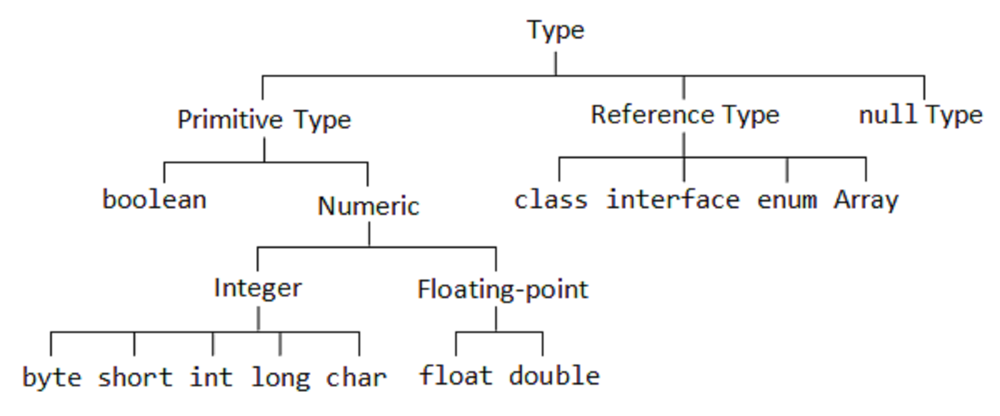

# 陣列

> 介紹Java如何宣告、使用陣列，以及記憶體中的配置。

### 什麼是陣列？ What is Array?

陣列是一種由相同型態的資料組成的資料結構。

陣列在記憶體中使用連續的記憶體空間，透過索引值(index)來做資料的存取。

陣列在Java裡是以物件(object)的方式存在，所以陣列本身是參考資料型態(reference type)。

陣列中的元素可以是基本資料型態(primitive type)也可以是參考資料型態(reference type)。

### 陣列的創建 Array Creation

陣列就跟一般的物件一樣，需要透過關鍵字new來創造實體，new後面要有： 1. 元素的資料型態 2. 元素個數

陣列被初始化後，每個元素都會被初始化為該型態的初始值(default value)。

假設我們需要一個大小為3的int陣列，範例程式：

```java
int[] array;  //  宣告
array = new int[3];  // 創建大小為3的int陣列，回傳reference給array
```

當然也可以寫成一行，這是等價的：

```java
int[] array = new int[3];
```

記憶體配置：

<figure><figcaption></figcaption></figure>

### 存取元素 Access Elements

透過陣列名稱，利用中括號『\[ ]』，括號裡面放元素在陣列中的索引值(index)。

**陣列索引值從0開始，只能為非負整數。**

以上圖為例：

```java
int[] array = new int[3];
array[0] = 1;
array[1] = 10;
array[2] = 100;
System.out.println(array[0]);
System.out.println(array[1]);
System.out.println(array[2]);
```

執行結果：

```java
1
10
100
```

### 初始化時給值 Array Initializer

陣列可以同時宣告及指定其值，利用大括號『{ }』，搭配逗號『,』隔開各元素。

```java
int[] array = { 1 , 10 , 100 };
```

編譯器會看大括號理的元素個數及元素值去創造相符的物件，回傳reference給變數array。

這行的效果跟下面相同：

```java
int[] array;
array = new int[3];
array[0] = 1;
array[1] = 10;
array[2] = 100;
```

這種寫法適用於在寫程式的時候已經確定該陣列的元素個數、內容。

### 多維陣列 Multi-Dimensional Array

上面已經討論過一維陣列的宣告及使用，但實務上我們遭遇很多問題並不是單靠一維陣列就可以簡單解決的，因此我們希望可以有一個多維度的陣列來幫我們做處理。

假設我們需要一個大小為2\*3二維的int陣列，範例如下：

```java
int[][] matrix;  // 宣告
matrix = new int[2][3];  // 創件空間，回傳reference給matrix
```

int\[ ]\[ ]是matrix的型態，代表是int的二為陣列，要幾個維度就用幾個『\[ ] 』。

new int\[2]\[3]，創造『大小為2個陣列』，其元素內容為『大小為3的int陣列』。

記憶體配置：

<figure><figcaption></figcaption></figure>

有沒有發現到，Java根本沒有所謂的多維陣列！它只是不斷的在一維陣列中塞另一個陣列！

一個m\*n的二維陣列，就是m個『大小為n的陣列』，更多維度一樣的概念以此類推，這裡只舉二維為例。(不然實在不好畫)

初始化的方法跟一維陣列相同，可以直接寫成程式碼：

```java
int[][] matrix = { {1,2,3} , {5,6,7} };
```

大括號夾起來的就是一個陣列，彼此用逗號『,』隔開，形成陣列中有陣列的樣子。

上述程式效果同於：

```java
int[][] matrix;  // 宣告 matrix 為 int[][] 型態。
matrix = new int[2][];  // matrix 是 『2 個 int[] 的陣列』的陣列
matrix[0] = new int[3]; // matrix[0] 是一個大小為 3 的 int 陣列
matrix[1] = new int[3]; // matrix[1] 是一個大小為 3 的 int 陣列
matrix[0][0] = 1; // 以下幾行利用中括號及索引值設定陣列元素的值
matrix[0][1] = 2;
matrix[0][2] = 3;
matrix[1][0] = 5;
matrix[1][1] = 6;
matrix[1][2] = 7;
```

也因為Java的陣列是這種特性，所以我們也可以創造出『長度不同』的多維陣列。

假設要創造出的陣列長這樣：

<figure><figcaption></figcaption></figure>

對Java來說，由於陣列在記憶體中都是一維的，不同長度只是指向不同的物件，所以可以輕鬆的初始化。

利用 Initializer ：

```java
int[][] array = { {10,20} , {100} , {5,6,7} };
```

這樣就可以達成要求了！

要一步一步寫的話像這樣：

```java
int[][] array;
array = new int[3][];
array[0] = new int[2];
array[1] = new int[1];
array[2] = new int[3];
array[0][0] = 10;
array[0][1] = 20;
array[1][0] = 100;
array[2][0] = 5;
array[2][1] = 6;
array[2][2] = 7;
```

## 參考型態陣列 Reference Type Array

前面舉的例子是int陣列，而我們知道int是基本資料型態，那如果要創件的是參考資料型態的陣列呢？

恩，就跟創造多維陣列一樣，層層的初始化每個物件。

假設我要創造大小為3的Human陣列： (Human為自訂類別)

```java
Human[] array;  // 宣告 array 為 Human一維陣列
array = new Human[3];  // 創造大小為3的陣列用來存放Human，回傳reference給array
array[0] = new Human();  // array[0]是物件，必須要初始化才能在記憶體中存在。
array[1] = new Human();  // 如果沒有對物件做初始化，預設值為null。
array[2] = new Human();  // 存取null的成員會產生 NullPointerException例外。
```

以上程式可以搭配迴圈使用，是一般常見的做法：

```java
Human[] array = new Human[3];
for(int i=0;i<3;i++)
    array[i] = new Human();
```

記憶體配置：

<figure><figcaption></figcaption></figure>

一個最大觀念是，Java的陣列是物件，且都是為一維的陣列。內容可以放值(value)或參考(reference)，因此可以陣列的內容是另一個陣列，創造出多維陣列的感覺。

記憶體的配置圖在陣列的觀念裡面很重要，一定要懂為什麼。如果有什麼不清楚的麻煩讓我知道，或許是文字或圖片沒弄好產生誤解或混淆。

### 陣列長度 length of Array

陣列被創造出來，元素個數就決定好了，很多時候我們需要陣列的大小(length)方便我們做運算、處理，那要如何取得呢？

恩，陣列是一個物件，它有一個資料成員用來紀錄它的大小，就叫做 length。

```java
int[] array = { 1 , 1 , 2 , 3 , 5 , 8 , 13 };
System.out.println(array.length);
```

執行結果：

```java
7
```

利用 `陣列名稱.length` 可以輕鬆取得該陣列的長度，搭配迴圈可以方便的走訪整個陣列：

```java
int[] array = { 1 , 1 , 2 , 3 , 5 , 8 , 13 };
int sum = 0;
for(int i = 0 ; i < array.length ; i++ )
    sum = sum + array[i];
System.out.println("陣列和為："+sum);
```

執行結果：

```java
陣列和為：33
```

### 好用方法 useful Method

簡單介紹幾個常用的方法，很多陣列相關方法都定義在Arrays裡，Arrays放在java.util套件中，使用前別忘了import：

```java
import java.util.Arrays;
```

#### 快速印出所有元素 Arrays.toString(Object\[])

利用這個方法，可以快速的印出陣列中的所有元素，方便自己debug或展示。

```java
int[] array = { 1, 1, 2, 3, 5, 8, 13 };
System.out.println(Arrays.toString(array));
```

執行結果：

```java
[1, 1, 2, 3, 5, 8, 13]
```

#### 複製陣列 .clone()

可以快速的複製一個一模一樣的資料的陣列物件，與原陣列佔用不同記憶體，彼此獨立。

```java
int[] array = { 1, 1, 2, 3, 5, 8, 13 };
int[] array2=array.clone();
array[0]=555;
System.out.println(Arrays.toString(array));
System.out.println(Arrays.toString(array2));
```

執行結果：

```java
[555, 1, 2, 3, 5, 8, 13]
[1, 1, 2, 3, 5, 8, 13]
```

#### 填滿陣列元素 Arrays.fill(Object\[],value)

可以把陣列全部用value填滿，常用於陣列初始化。

```java
int[] array = new int[10];
System.out.println(Arrays.toString(array));
Arrays.fill(array, -1);  // 以 -1 填滿 array
System.out.println(Arrays.toString(array));
```

執行結果：

```java
[0, 0, 0, 0, 0, 0, 0, 0, 0, 0]
[-1, -1, -1, -1, -1, -1, -1, -1, -1, -1]
```

#### 陣列排序 Arrays.sort(Object\[]);

這個方法超美妙的，可以把陣列從小排到大，內部實做是快速排序法(quick sort)，時間複雜度 O(NlogN)，比較的機制是該物件的 .compareTo()方法，實做上可以省掉很多寫排序演算法的時間。

```java
int[] array = {50,1,-999,6000,77,3,50,0};
System.out.println(Arrays.toString(array));
Arrays.sort(array);
System.out.println(Arrays.toString(array));
```

執行結果：

```java
[50, 1, -999, 6000, 77, 3, 50, 0]
[-999, 0, 1, 3, 50, 50, 77, 6000]
```

#### 陣列搜尋 Arrays.binarySearch(Object\[],key)

利用binarySearch搜尋陣列中目標key的索引值，時間複雜度為O(logN)，如果找不到回傳小於0的整數。因為是用binarySearch實做，所以陣列『必須已排序好(遞增)』。

```java
int[] array = {50,1,-999,6000,77,3,50,0};
System.out.println(Arrays.toString(array));
Arrays.sort(array);
System.out.println(Arrays.toString(array));
System.out.println(Arrays.binarySearch(array, 77));
System.out.println(Arrays.binarySearch(array, 2000));
```

執行結果：

```java
[50, 1, -999, 6000, 77, 3, 50, 0]
[-999, 0, 1, 3, 50, 50, 77, 6000]
6    // 77 位在索引值6的位置
-8   // 2000 不存在陣列中
```

#### 陣列相等 Arrays.equals(Object\[],Object\[])

測試兩陣列是否相等，回傳布林值(true or false)。

相等的條件：每個陣列元素的值、順序都完全一樣，若 reference 指到同一物件視為相等，都為 null 也視為相等。

```java
int[] array = { 5, 6, 7 };
int[] array2 = array.clone();
System.out.println(Arrays.equals(array, array2));
array[0] = 1;
System.out.println(Arrays.equals(array, array2));
array = array2;
System.out.println(Arrays.equals(array, array2));
array = null;
array2 = null;
System.out.println(Arrays.equals(array, array2));
```

執行結果：

```java
true   // array2 是 array 複製過來的，所以資料完全一樣，故相等
false  // array變成{1,6,7}，array2還是{5,6,7}，不相等
true   // array 指到 array2的物件，故兩個reference相同，相等
true   // 兩個皆為 null 視為相等
```

其他詳細方法請參考 [document](https://docs.oracle.com/javase/8/docs/api/java/util/Arrays.html)。
